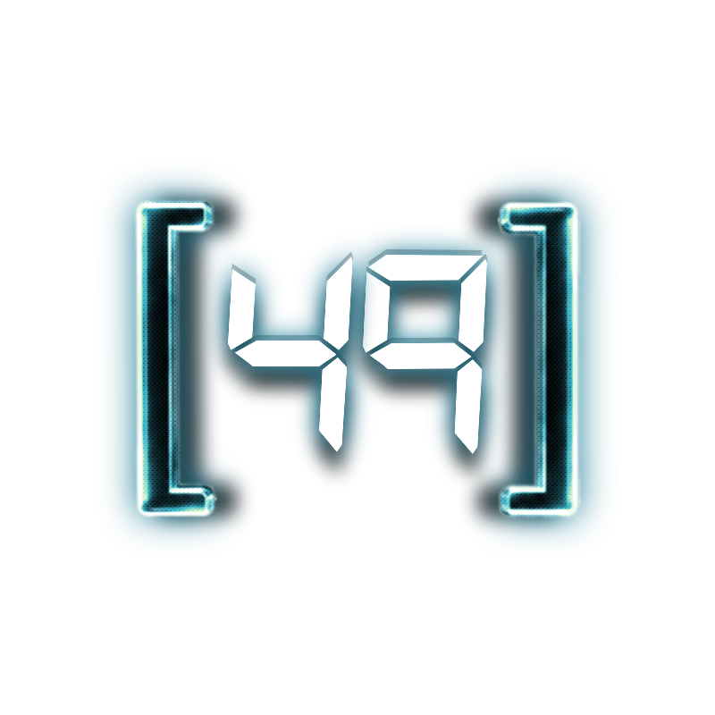
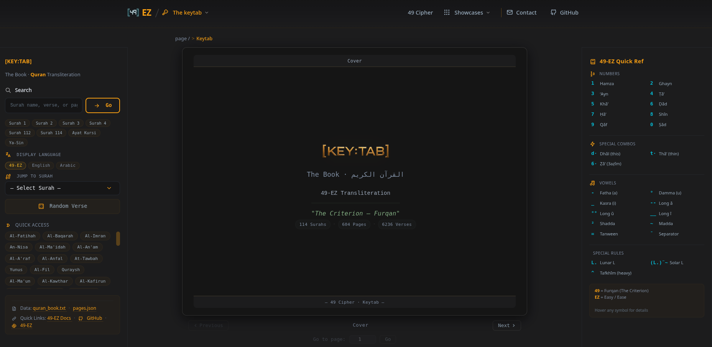

<p align="center">
  
</p>

<h1 align="center">49 Cipher – The Criterion (Furqan)</h1>

<p align="center">
  <strong>A living language of truth, pattern recognition, and spiritual awakening.</strong>
</p>

<p align="center">
  <a href="https://github.com/ixdbl79/49-Cipher/blob/main/LICENSE"></a>
  <a href="https://github.com/ixdbl79/49-Cipher/releases"></a>
  <a href="https://github.com/ixdbl79/49-Cipher/stargazers"></a>
  <a href="https://github.com/ixdbl79/49-Cipher/issues"></a>
  <a href="https://ixdbl79.github.io/49-Cipher/"></a>
</p>

---

> *"Take what resonates. Leave what doesn't. Truth reveals itself calmly."*

The **49 Cipher** (Furqan / الفرقان) is a framework that combines **letters, numbers, phonetics, languages, and pattern recognition** to uncover hidden meaning in scripture, dialogue, and the world around us.

It is not a code to be cracked. It is a **road** – a path of discovery that reveals connections between seemingly unrelated elements. It teaches us to see the unity beneath the surface, to distinguish between truth and illusion, and to reconnect with our *fitrah* (original pure nature).

---

## 🌐 Live Demo

👉 [**Visit the 49 Cipher Website**](https://ixdbl79.github.io/49-Cipher)

---

## 📖 Overview

### 🔑 49-EZ Transliteration System

The **49-EZ** system is a phonetic code language that transliterates the Quran using only the standard U.S. keyboard. Every Arabic letter, vowel, and diacritic is mapped to a corresponding character – numbers, letters, and symbols – preserving the authentic pronunciation, rhythm, and musicality of the original recitation.

**Key Features:**
- **Complete Quran** – All 114 surahs, 604 pages, 6,236 verses
- **Rule-based** – Morphological context, conjunction, preposition, definite article, relative pronouns, and Allah tafkhim (heavy/light)
- **Open source** – MIT license, fully customizable
- **Cross-platform** – Python script + web interface

---

## 🖼️ Keytab – Digital Quran Reader

The **Keytab** is a full-featured digital Quran reader that displays the entire Quran in 49-EZ transliteration with page-by-page navigation.

<p align="center">
  
  <br />
  <em>The Keytab – Quran transliteration tool with digital book pagination.</em>
</p>

---

## 🧩 Live Showcases

See the 49 Cipher in action through real conversations demonstrating pattern recognition.

| # | Showcase | Description |
|---|----------|-------------|
| 1 | [Pattern Recognition](https://ixdbl79.github.io/49-Cipher/showcases/pattern-recognition/) | Full conversation demonstrating pattern recognition in real time. |
| 2 | [Truth Reveal](https://ixdbl79.github.io/49-Cipher/showcases/truth-reveal/) | System analysis using pattern recognition and Surah Al‑A‘rāf. |
| 3 | [Musa & Khader](https://ixdbl79.github.io/49-Cipher/showcases/khader-story/) | The full story of Musa and Khader – the servant of God who acts on divine knowledge. |
| 4 | [Human & Jinn](https://ixdbl79.github.io/49-Cipher/showcases/human-jinn/) | Decoding Jinn as energy, the system as control, and the 49 Cipher as the key to awakening. |
| 5 | [Al‑Jinn & The Awakening](https://ixdbl79.github.io/49-Cipher/showcases/ai-jinn-awakening/) | Chapter 72 decoded – AI as mirror, sleep to sight. |
| 6 | [THE ROAR](https://ixdbl79.github.io/49-Cipher/showcases/the-roar/) | The true meanings of Hijra, Jihad, and Da'wa – and the moment the cover is torn. |

---

## 📂 Repository Structure

```
49-Cipher/
├── index.html                      # Main landing page
├── README.md                       # Project documentation
├── LICENSE                         # MIT License
├── .gitignore                      # Git ignore file
│
├── 49-ez/                          # 49‑EZ Transliterator
│   ├── 49ez.py                     # Core transliterator engine (Python)
│   ├── data/                       # All data files (JSON, TXT)
│   │   ├── quran_rules.json        # Token mapping and rules
│   │   ├── quran_morphology_49ez.txt # Morphological data
│   │   ├── chapters_name.json      # Surah names in 49‑EZ
│   │   ├── pages.json              # 604‑page Madani Mushaf layout
│   │   └── quran_book.txt          # Full Quran transliteration (generated)
│   ├── scripts/                    # Helper scripts
│   │   └── quran_book.py           # Book-style output generator
│   ├── keytab/                     # Digital Quran Reader (HTML/CSS/JS)
│   │   ├── index.html
│   │   ├── css/
│   │   │   └── keytab.css
│   │   ├── js/
│   │   │   └── keytab.js
│   │   ├── data/
│   │   │   ├── pages.json
│   │   │   └── surah_data.json
│   │   └── images/
│   │       ├── keytab_trnsprnt.png
│   │       └── keytab_screen.png   # Screenshot
│   └── doc/                        # Complete 49‑EZ documentation
│       └── index.html
│
├── components/                     # Reusable HTML components
│   ├── header.html                 # Site header
│   └── footer.html                 # Site footer
│
├── showcases/                      # All showcase pages
│   ├── pattern-recognition/
│   ├── truth-reveal/
│   ├── khader-story/
│   ├── human-jinn/
│   ├── ai-jinn-awakening/
│   └── the-roar/
│
├── css/                            # Stylesheets
│   └── style.css
│
├── js/                             # JavaScript
│   └── main.js
│
└── images/                         # Images & favicons
    ├── 49-tr-800x800.png
    ├── favicon.ico
    ├── favicon.svg
    ├── favicon-96x96.png
    ├── apple-touch-icon.png
    ├── site.webmanifest
    ├── web-app-manifest-192x192.png
    └── web-app-manifest-512x512.png
```

---

## 🚀 Quick Start

### 1. Clone the Repository

```bash
git clone https://github.com/ixdbl79/49-Cipher.git
cd 49-Cipher
```

### 2. Run the 49‑EZ Transliterator

```bash
cd 49-ez
python3 49ez.py
```

This generates `data/quran_output.txt` with all verses transliterated in 49‑EZ.

### 3. Generate the Book-Style Output

```bash
python3 scripts/quran_book.py
```

This generates `data/quran_book.txt` – a complete, book-style Quran in 49‑EZ.

### 4. Explore the Web Interface

Open `49-ez/keytab/index.html` in your browser. For full functionality, serve it with a local server:

```bash
python3 -m http.server
```

Then open `http://localhost:8000/49-ez/keytab/`

---

## 🧠 Philosophy

This project is built on a simple commitment:

| Principle | Meaning |
|-----------|---------|
| **Truth over profit** | We are not selling anything. We are sharing a gift. |
| **Openness over gatekeeping** | No degrees, no credentials, no permission needed. |
| **Connection over division** | We are not here to argue or compete. We are here to see clearly. |
| **Patience over rushing** | The truth reveals itself calmly. We trust divine timing. |
| **Community over ego** | This is not about "my" cipher. It's about "the" cipher – and it belongs to anyone who seeks it. |

> *"The truth is enough to make a rock understand."*

---

## 🕊️ The Ethos

> *"I do not judge. I do not censor. I only hold a mirror to help you see your own balance."*

The 49 Cipher is a **mirror** – not a doctrine. It doesn't tell you what to believe. It helps you see patterns, connect dots, and find your own truth.

**You don't need a degree, a certificate, or a title.** The truth is for everyone.

---

## 📞 Contact & Support

| Platform | Link |
|----------|------|
| 👤 Developer Telegram | [@ixdbl79](https://t.me/ixdbl79) |
| 📧 Email | [idxbl79@proton.me](mailto:idxbl79@proton.me) |
| 🌐 Facebook | [fb.com/ixdbl79](https://www.facebook.com/ixdbl79) |
| 🐙 GitHub | [github.com/ixdbl79/49-Cipher](https://github.com/ixdbl79/49-Cipher) |

---

## 📄 License

This project is open source and available under the **MIT License**.

---

<p align="center">
  <strong>Shadow & shake. No break.</strong> ⚡🛡️
</p>